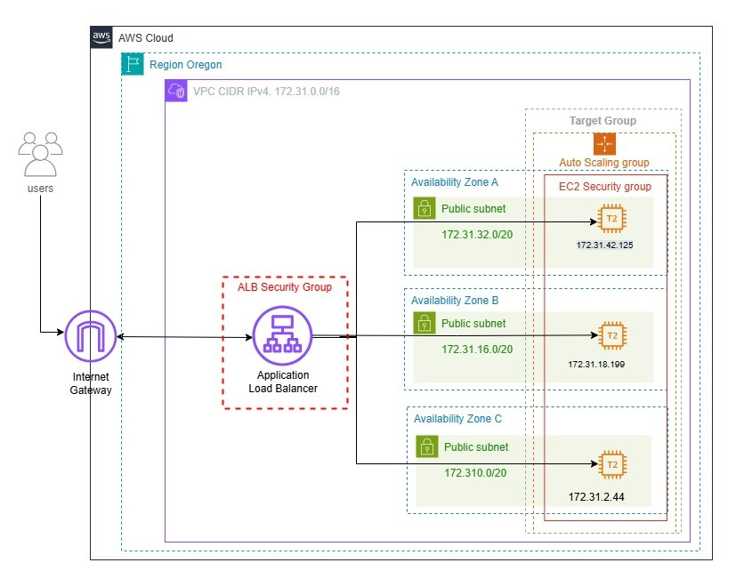
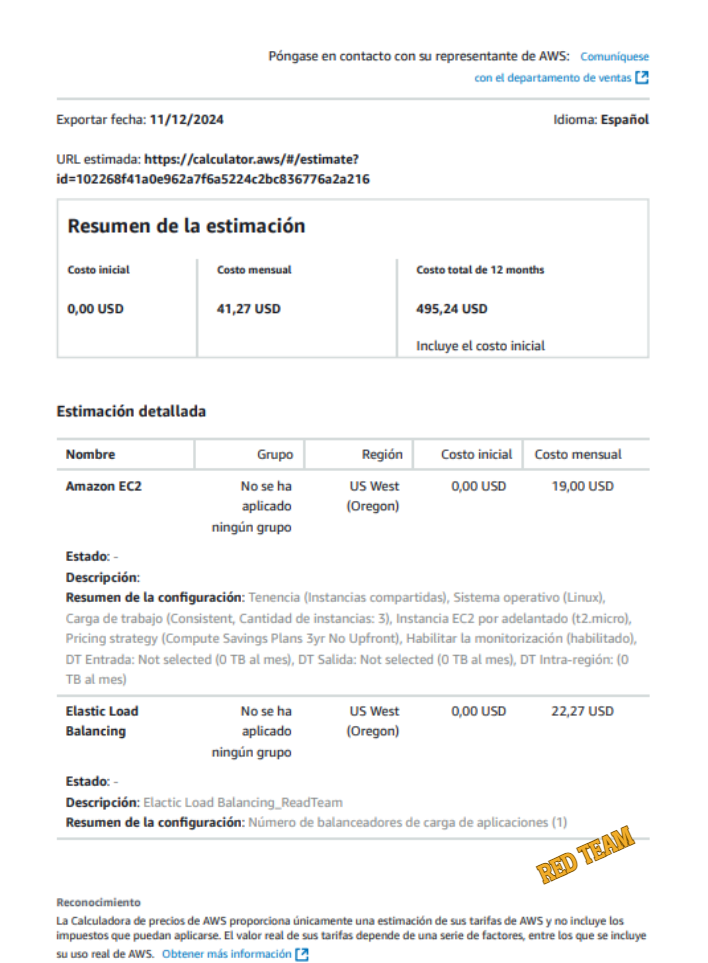

# Proyecto Final: AWS - Red Team

## Miembros del Equipo

  

    
    
Ana González

  

  

    
    
Anaís Reyes

  

  

    
    
Mª del Carmen Fernández

  

  

    
    
Mar Prieto

  

  

    
    
Paula Sanz

  

  

    
    
Sherley Johana Pardo

  

## Objetivo del Proyecto
El cliente desea desplegar una web estática en AWS que cumpla con los siguientes requisitos:
- Alta disponibilidad: Garantizar que la caída de una zona de disponibilidad no afecte el servicio.
- Escalabilidad: Manejar incrementos en el tráfico sin interrupciones del servicio.

## Procedimiento
El proyecto se llevó a cabo siguiendo los pasos:

1. **Desarrollo de la web**: Implementación de una página estática sencilla.
2. **Creación de plantilla de lanzamiento**: Configuración inicial para el despliegue.
3. **Creación de grupo de Auto Scaling**: Ajuste automático del número de instancias según la demanda.
4. **Configuración del ELB (Elastic Load Balancer)**: Distribución del tráfico entre las instancias.
5. **Configuración de grupos de seguridad**: Políticas de acceso para EC2 y ELB.

## Diagrama de Arquitectura

## Mejoras Propuestas para el Cliente
Se identificaron herramientas adicionales para optimizar la solución:
- **Amazon CloudFront**: CDN para una entrega más rápida de contenido.
- **Amazon RDS**: Base de datos administrada.
- **Amazon S3**: Almacenamiento para contenido estático.
- **AWS WAF**: Firewall para aplicaciones web.
- **Políticas avanzadas de Auto Scaling**: Escalado más eficiente y granular.
- **Route 53**: Gestión avanzada de DNS.

## Demo
Puedes ver una demostración del proyecto en AWS [aquí](https://youtu.be/vYToZIg20BM).

## Presupuesto
El proyecto fue diseñado para ser rentable, aprovechando los servicios escalables y de pago por uso de AWS.

## Preguntas
Si tienes alguna consulta, no dudes en preguntar. ¡Gracias por tu atención!

